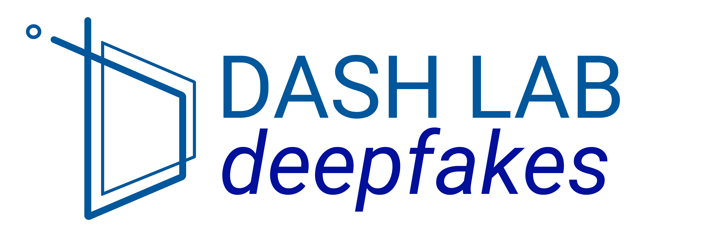

## Introduction

This repository provides a list a list of publications from [DASHLab](https://dash-lab.github.io/) about Deepfakes.

### Dataset
Our published datasets of deepfakes.

#### Paper List:
**`2023`**: `Towards Understanding of Deepfake Videos in the Wild` accepted by **CIKM23**. [[paper](https://dash-lab.github.io/Publications/)]

**`2022`**: `Zoom-DF: A dataset for Video Conferencing Deepfake` accepted by **WDC22**. [[paper](https://dl.acm.org/doi/abs/10.1145/3494109.3527195) ]

**`2021`**: `FakeAVCeleb: A Novel Audio-Video Multimodal Deepfake Dataset` accepted by **NeurIPS21**. [[paper](https://arxiv.org/abs/2108.05080)]

### Generalization
Methods to generalize deepfake detectors.

#### Paper List:

**`2021`**: `One Detector to Rule Them All: Towards a General Deepfake Attack Detection Framework` accepted by **WWW21**. [[paper](https://dl.acm.org/doi/abs/10.1145/3442381.3449809)]

**`2021`**: `FReTAL: Generalizing Deepfake Detection using Knowledge Distillation and Representation Learning` accepted by **CVPRW21**. [[paper](https://openaccess.thecvf.com/content/CVPR2021W/WMF/html/Kim_FReTAL_Generalizing_Deepfake_Detection_Using_Knowledge_Distillation_and_Representation_Learning_CVPRW_2021_paper.html)]

**`2021`**: `TAR: Generalized Forensic Framework to Detect Deepfakes using Weakly Supervised Learning` accepted by **IFIP-SEC 21**. [[paper](https://arxiv.org/abs/2105.06117)]

### Low-quality compressed deepfake detection
Our published papers that related to detecting low-quality compressed deepfakes.

#### Paper List:
**`2023`**: `Quality-Agnostic Deepfake Detection with Intra-model Collaborative Learning` accepted by **ICCV23**. [[paper](https://dash-lab.github.io/Publications/)]

**`2022`**: `ADD: Frequency Attention and Multi-View Based Knowledge Distillation to Detect Low-Quality Compressed Deepfake Images` accepted by **AAAI22**. [[paper](https://ojs.aaai.org/index.php/AAAI/article/view/19886)]

**`2022`**: `BZNet: Unsupervised Multi-scale Branch Zooming Network for Detecting Low-quality Deepfake Videos` accepted by **WWW22**. [[paper](https://dl.acm.org/doi/abs/10.1145/3485447.3512245)]

### Continual learning
Our published papers that related to applying continual learning to detect newly arrived deepfakes/GAN.

#### Paper List:

**`2021`**: `CoReD: Generalizing Fake Media Detection with Continual Representation using Distillation` accepted by **ACMMM21**. [[paper](https://arxiv.org/abs/2107.02408)]

**`2020`**: `T-GD: Transferable GAN-generated Images Detection Framework` accepted by **ICML20**. [[paper](https://arxiv.org/abs/2008.04115)]

### Evading deepfake detectors and privacy
Our published papers that related to evasion techniques to fool deepfake detectors.

#### Paper List:

**`2024`**: `Beyond the Screen: Evaluating Deepfake Detectors under Moir ́e Pattern Effects` accepted by **WMF-CVPR24**. [[paper](https://openaccess.thecvf.com/content/CVPR2024W/WMF/papers/Tariq_Beyond_the_Screen_Evaluating_Deepfake_Detectors_under_Moire_Pattern_Effects_CVPRW_2024_paper.pdf)]

**`2024`**: `Exploring the Impact of Moiré Pattern on Deepfake Detectors
` accepted by **ICIP24**. [[paper](https://arxiv.org/pdf/2407.10399)]

**`2023`**: `Evaluating Racial Bias in Face Recognition APIs using Deepfakes` accepted by **IEEE Computer Magazine**. 

**`2022`**: `Am I a Real or Fake Celebrity? Evaluating Face Recognition and Verification APIs under Deepfake Impersonation Attack` accepted by **WWW2022**. [[paper](https://arxiv.org/abs/2103.00847)]

**`2022`**: `Evading Deepfake Detectors via High-Quality Face Pre-Processing Methods` accepted by **ICPR22**. [[paper](https://ieeexplore.ieee.org/document/9956520)]

**`2022`**: `Negative Adversarial Example Generation Against Naver’s Celebrity Recognition API` accepted by **WDC22**. [[paper](https://dl.acm.org/doi/abs/10.1145/3494109.3527193)]

**`2022`**: `A Face Pre-Processing Approach to Evade Deepfade Detector` accepted by **WDC22**. [[paper](https://dl.acm.org/doi/10.1145/3494109.3527190)]

### Multi-model
Our published papers that related to  applying multi-model to detect deepfakes.

#### Paper List:

**`2022`**: `Evaluation of an Audio-Video Multimodal Deepfake Dataset using Unimodal and Multimodal Detectors` accepted by **ADGD21**. [[paper](https://arxiv.org/abs/2109.02993)]

### Detection method - miscellaneous

#### Paper List:
**`2025`**: `SoK: Systematization and Benchmarking of Deepfake Detectors in a Unified Framework` accepted by **Euro S&P' 25**. [[paper](https://arxiv.org/pdf/2401.04364)]

**`2024`**: `UGAD: Universal Generative AI Detector utilizing Frequency Fingerprints` accepted by **CIKM24**. [[paper](https://cikm2024.org/)]

**`2024`**: `iFakeDetector: Real Time Integrated Web-based Deepfake Detection System` accepted by **IJCAI24**. [[paper](https://www.ijcai.org/proceedings/2024/1016.pdf)]

**`2023`**: `SAFE: Sequential Attentive Face Embedding with Contrastive Learning for Deepfake Video Detection` accepted by **CIKM23**. [[paper](https://dl.acm.org/doi/abs/10.1145/3583780.3615279)]

**`2022`**: `Deepfake Detection for Facial Images with Facemasks` accepted by **WDC22**. [[paper](https://arxiv.org/abs/2202.11359)]

**`2021`**: `Exploring the Asynchronous of the Frequency Spectra of GAN-generated Facial Images` accepted by **IJCAIW21**. [[paper](https://arxiv.org/abs/2112.08050)]

**`2020`**: `OC-FakeDect: Classifying Deepfakes Using One-class Variational Autoencoder` accepted by **CVPRW20**. [[paper](https://openaccess.thecvf.com/content_CVPRW_2020/papers/w39/Khalid_OC-FakeDect_Classifying_Deepfakes_Using_One-Class_Variational_Autoencoder_CVPRW_2020_paper.pdf)]

**`2020`**: `FDFtNet: Facing Off Fake Images using Fake DetectionFine-tuning Network`  accepted by **IFIP-SEC 20**. [[paper](https://arxiv.org/abs/2001.01265)]

**`2019`**: `GAN is a Friend or Foe? A Framework to Detect Various Fake Face Images` accepted by **ACMSAC19**. [[paper](https://dl.acm.org/doi/10.1145/3297280.3297410)]

#### Research Project Involvements

**`2023-2025`**. 악의적 변조 콘텐츠 대응을 위한 딥페이크 탐지 고도화, 생성억제, 유포 방지 플랫폼 개발 (IITP)

**`2022-2023`**. 딥페이크 탐지 및 칩페이크 탐지 모델 연구 및 고도화 (삼성SDS)

**`2020-2022`**. 인공지능 기반의 딥페이크 멀티미디어 탐지 연구 (한국연구재단 우수신진)

**`2020`**. 지능형 동영상 합성(딥페이크) 검출을 위한 연구 용역 (국립과학수사연구원)

**`2020`**. 딥페이크 기술을 활용한  온라인 불법행위 대응방안 (경찰청)

